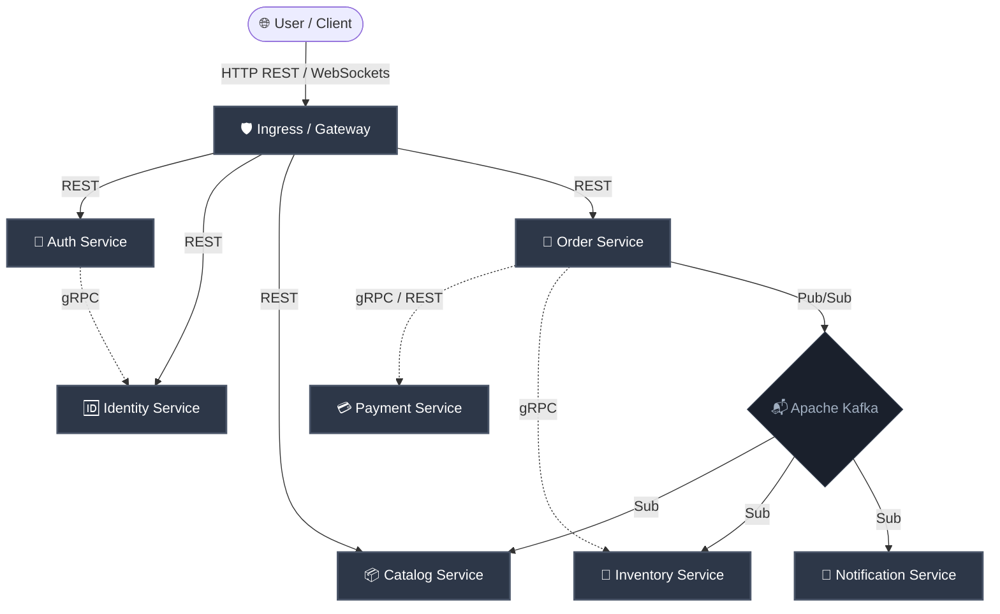

# 🔬 Microservices Research Platform

An experimental commerce backend ecosystem built on **Clean Architecture**, **Domain-Driven Design (DDD)**, and **GitOps delivery** — engineered for architectural exploration, prototyping, and academic validation rather than production SLAs.

---

  
  
  
  
  
  
  
  

---

## 🏗️ Architecture Blueprint

The platform explores domain purity, event-driven reliability, and resilience patterns in a research context. Service-to-service communication is deliberately varied — gRPC is used to study low-latency synchronous interactions, while Apache Kafka provides a foundation for experimenting with asynchronous integration events and distributed coordination.

---

## 💡 What This Is?

This platform serves as an experimental microservices sandbox, modeling a decoupled commerce backend across multiple independently deployable services. Rather than being optimized for production SLAs, it is unified by a shared architectural contract enforced at compile/build time — enabling controlled experiments, architectural validation, and comparative studies of distributed system patterns.

### 🌟 Core Principles & Highlights:
*   **Domain Purity Enforced via ArchUnit:** Business logic is intentionally kept framework‑agnostic. Experiments include enforcing boundaries and observing how leakage detection impacts modularity at build time.
*   **Transactional Outbox/Inbox & Custom Saga Studies:** Investigating reliability of cross‑service integration and distributed transaction coordination through controlled experiments with transactional outbox/inbox pipelines.
*   **GitOps-driven Delivery Experiments:** Exploring declarative deployment flows with ArgoCD and Helm, focusing on reproducibility and resilience rather than strict zero‑downtime guarantees.
*   **Observability-first Runtime Research:** Profiling runtime behavior, autoscaling responses, and instrumentation strategies with Prometheus and Grafana to evaluate observability trade‑offs in microservices ecosystems.

---

## 📊 Platform at a Glance

| Layer | Technology & Abstractions |
| :--- | :--- |
| **Language & Framework** | Java 25 (Modern JVM), Spring Boot 4.0+ |
| **Transport Protocol** | HTTP REST (Web UI), gRPC (High-speed internal communication) |
| **Messaging Egress** | Apache Kafka Cluster (Partitioned & High availability) |
| **Persistence Engine** | PostgreSQL Cluster + JPA / EntityManager (Isolated per service) |
| **Indexing / Search** | Elasticsearch (Logstash + Beats automated ingestion) |
| **Caching Layer** | Redis / Redisson (Distributed locking and session registry) |
| **Distributed Saga** | Custom Saga Coordinator (Outbox & Inbox transactional pipeline) |
| **Resource** | Pluggable storage abstraction with three modes: Local filesystem, AWS S3, and Azure Blob |
| **Observability** | Prometheus (Scraping) · Grafana (Visualizing) · Micrometer (Instrumentation) |
| **CI/CD Pipeline** | Jenkins Multi-branch Pipeline → Docker Registry → ArgoCD → Kubernetes |
| **Quality Gate** | ArchUnit (Local & CI architecture isolation checks) |

---

## 📦 Repositories & Modules

> [!NOTE]  
> At this stage, only **Auth** and **Identity** services have been implemented.
> The **shared-kernel** and **shared-services** repositories are private and not publicly accessible.
> Other services are still in the design phase and serve as placeholders for ongoing research.

| Repository | Role / Capability |
| :--- | :--- |
| **[`shared-kernel`](https://github.com/TriJames23/shared-kernel)** | Core domain interfaces, context objects, and framework-agnostic models. |
| **[`shared-services`](https://github.com/TriJames23/shared-services)** | Shared infrastructure starters: Kafka inbox/outbox adapters, gRPC, Redis locks. |
| **[`identity-service`](https://github.com/TriJames23/identity-service-repo)** | User registration, authentication, token verification, and active session management. |
| **[`auth-service`](https://github.com/TriJames23/auth-service-repo)** | Authorization profiles, Lower-case resource permission mapping, gRPC verification. |
| **`catalog-service`** | Product catalog management, synchronized with Elasticsearch search indexes. |
| **`order-service`** | Core checkout orchestrator, coordinating Order Saga and distributed execution. |
| **`inventory-service`** | Stock allocation, reservation management, and transactional rollbacks. |
| **`payment-service`** | Credit card processing, billing records, and payment status updates. |
| **`cart-service`** | Temporary shopping cart storage backing up to distributed Redis caches. |
| **`notification-service`** | Outbound notification dispatcher utilizing gRPC streams and WebSockets. |
| **`shop-service`** | Multi-tenant vendor configuration and shop catalog domains. |
| **[`micro-config-repo`](https://github.com/TriJames23/shared-micro-config-repo)** | Core Helm chart overrides and Spring configuration files per environment. |
| **[`platform-helm-charts-repo`](https://github.com/TriJames23/platform-helm-charts-repo)** | Reusable generic Helm Chart templates used across all microservices. |

---

## 📖 Recommended Reading Order

> [!NOTE]
> Each document is written with high signal density, excluding fluff, to provide deep technical clarity for engineers and architects.

1.  **[System Overview](docs/architecture/system-overview.md)** — Core ecosystem layout, active databases, ports, and cross-communication.
2.  **[Deployment & GitOps](docs/architecture/deployment-and-gitops.md)** — Jenkins CI Pipelines and declarative ArgoCD Kubernetes environments.
3.  **[Event-Driven Architecture](docs/architecture/event-driven-architecture.md)** — Reliable messaging via transactional Outbox/Inbox and Saga processing.
4.  **[Observability Architecture](docs/architecture/observability-architecture.md)** — High-precision Spring Actuator instrumentation, alerting, and Grafana dashboards.
5.  **[Clean Architecture Boundary](docs/architecture/clean-architecture.md)** — Domain purity enforcement, ports/adapters, and building cleanly.

---

## 🛡️ Architecture Decision Records (ADRs)

All core platform architectural decisions are formally documented under [`/docs/adr`](docs/adr/README.md).

> [!TIP]
> Reading these decision logs helps explain the underlying "Why?" behind major design choices.

*   **[ADR-001 — Shared Kernel Purity](docs/adr/ADR-001-shared-kernel-purity.md)**: Zero external web/DB frameworks allowed inside the shared kernel.
*   **[ADR-003 — Execution Context Ownership](docs/adr/ADR-003-execution-context-ownership.md)**: Propagating Identity, Tenant, and Trace IDs across layers without polluting domain signatures.
*   **[ADR-004 — Event-Driven Saga Orchestration](docs/adr/ADR-004-event-driven-saga-orchestration.md)**: Defining event-driven orchestration and state management for Sagas.
*   **[ADR-005 — Outbox Pattern](docs/adr/ADR-005-outbox-pattern.md)**: Guaranteeing At-Least-Once event dispatching from persistence layers.
*   **[ADR-013 — CQRS Implementation Strategy](docs/adr/ADR-013-CQRS-Implementation-Strategy.md)**: Enforcing strict CQRS boundaries to protect invariants on the command side.
*   **[ADR-015 — Inbox Pattern](docs/adr/ADR-015-inbox-pattern.md)**: Ensuring idempotent consumer processing for inbound Kafka events.
*   **[ADR-018 — Clean Boundary Enforcement](docs/adr/ADR-018-clean-boundary-enforcement.md)**: Preventing dependency leakage using ArchUnit tests in CI gates.
*   **[ADR-028 — Worker-Scheduler Engine Split](docs/adr/ADR-028-worker-scheduler-engine-split.md)**: Decoupling message-processing loops from periodic background tasks for better scalability.

---

## 🎨 System Diagrams & Assets

| Architectural Flow | Visual Resource |
| :--- | :--- |
| **System Overview & Lanes** | [📄 System Overview Diagram](diagrams/system-overview.png) |
| **Reliable Event Delivery** | [📄 Event-Driven Egress/Ingress Flow](diagrams/event-driven-flow.png) |
| **Deployment Lifecycle** | [📄 Jenkins & ArgoCD Deployment Pipeline](diagrams/deployment-flow.png) |
| **Kubernetes Topology** | [📄 Pods, Services, and HPA Topology](diagrams/kubernetes-runtime.png) |
| **Observability Pipeline** | [📄 Observability and Scraping Flows](diagrams/observability-architecture.png) |

---

## 🔍 Deep-Dive Technical Modules

Ready for source-code implementations and deep architectural walkthroughs?

👉 **[Go to deep-dives directory](docs/deep-dive/)** (Covers Aggregate Reconstitution, gRPC E2E Pipeline, Scheduler Engines, and Inbox/Outbox details).
