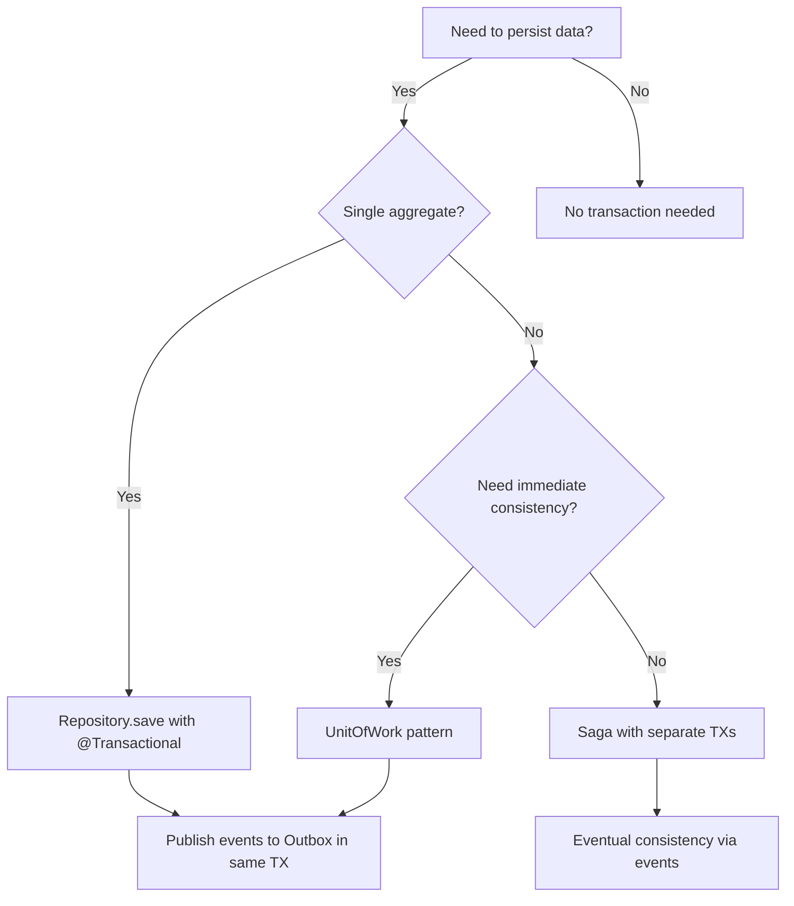

# ADR-012: Transaction Boundary & UnitOfWork Ownership

**Status**: ✅ Accepted  
**Date**: 2026-Q1  
**Enforced By**: ArchUnit + Code Review

---

## Context

Transaction management is one of the most contentious architectural decisions. Without clear boundaries, teams debate:

- **Who opens transactions?** Application? Infrastructure? Repository?
- **Scope**: 1 use case = 1 transaction, or multiple?
- **Interaction**: How do Saga + Outbox + Retry interact with transactions?
- **Failure modes**: What happens when retry wraps transaction? When Saga compensates mid-transaction?

**Unclear transaction ownership leads to**:
- Retry storms (retrying entire transaction)
- Deadlocks (nested transactions)
- Data inconsistency (partial commits)
- Performance degradation (long-running transactions)

---

## Decision

Transaction boundaries are **Infrastructure concerns**, controlled by **Repository implementations** or **UnitOfWork adapters**.

### Core Principles

#### 1. Application Layer is Transaction-Agnostic

- Application Services **MUST NOT** use `@Transactional`
- Application orchestrates business logic, not transaction lifecycle
- Application calls Repository methods, which handle transactions internally

#### 2. Infrastructure Controls Transaction Boundaries

- Repository implementations **MAY** use `@Transactional`
- UnitOfWork adapter **MAY** use `@Transactional`
- Transaction scope = **single aggregate persistence operation**

#### 3. One Use Case ≠ One Transaction

- Use cases may involve multiple aggregates
- Each aggregate save = separate transaction
- Consistency via **Saga** (eventual) or **Outbox** (reliable messaging)

#### 4. Saga + Outbox + Transaction Interaction

```
Application Service
  ├─> Save Aggregate (TX1)
  ├─> Publish Domain Event to Outbox (TX1)  ← Same TX
  └─> Saga listens to event (TX2)           ← Separate TX
      └─> Compensate if needed (TX3)        ← Separate TX
```

---

## Transaction Patterns

### Pattern 1: Single Aggregate (✅ Recommended)

```java
// Application (No @Transactional)
@Service
public class OrderService {
    public void placeOrder(PlaceOrderCommand cmd) {
        Order order = Order.create(cmd);
        orderRepository.save(order); // TX boundary here
    }
}

// Infrastructure (Controls TX)
@Component
class JpaOrderRepository implements OrderRepository {
    @Transactional  // ✅ Infrastructure controls TX
    public void save(Order order) {
        OrderJpaEntity entity = OrderJpaEntity.fromDomain(order);
        entityManager.persist(entity);
        
        // Publish domain events to outbox (same TX)
        order.getDomainEvents().forEach(event -> {
            outboxRepository.save(new OutboxEntry(event));
        });
    }
}
```

### Pattern 2: Multiple Aggregates (✅ Saga-based)

```java
// Application (Orchestrates, no TX)
@Service
public class CheckoutService {
    public void checkout(CheckoutCommand cmd) {
        // Each save = separate TX
        Order order = Order.create(cmd);
        orderRepository.save(order); // TX1
        
        // Saga will handle payment asynchronously
        // If payment fails, Saga compensates order (separate TX)
    }
}

// Saga (Separate TXs per step)
public class CheckoutSaga {
    @SagaEventHandler
    public void on(OrderPlacedEvent event) {
        // TX2: Request payment
        commandGateway.send(new RequestPaymentCommand(event.getOrderId()));
    }
    
    @SagaEventHandler
    public void on(PaymentFailedEvent event) {
        // TX3: Compensate order
        Order order = orderRepository.findById(event.getOrderId());
        order.cancel();
        orderRepository.save(order);
    }
}
```

### Pattern 3: UnitOfWork (✅ For complex cases)

```java
// Application (Uses UnitOfWork abstraction)
@Service
public class ComplexService {
    private final UnitOfWork unitOfWork;
    
    public void complexOperation(Command cmd) {
        unitOfWork.execute(() -> {
            // Multiple operations in single TX
            Aggregate1 agg1 = repository1.findById(cmd.getId1());
            Aggregate2 agg2 = repository2.findById(cmd.getId2());
            
            agg1.doSomething();
            agg2.doSomethingElse();
            
            repository1.save(agg1);
            repository2.save(agg2);
        });
    }
}

// Infrastructure (UnitOfWork implementation)
@Component
class JpaUnitOfWork implements UnitOfWork {
    @Transactional
    public void execute(Runnable operation) {
        operation.run();
    }
}
```

---

## Anti-Patterns

### ❌ WRONG: @Transactional in Application

```java
@Service
public class OrderService {
    @Transactional  // ← VIOLATION: Application controls TX
    @Retry(maxAttempts = 3)
    public void placeOrder(PlaceOrderCommand cmd) {
        // Each retry = new TX = lock contention
    }
}
```

**Why wrong**: Retry wraps transaction, causing retry storms.

### ❌ WRONG: Nested Transactions

```java
@Service
@Transactional  // ← Outer TX
public class OrderService {
    public void placeOrder(PlaceOrderCommand cmd) {
        orderRepository.save(order); // ← Inner TX (nested)
        // Deadlock risk
    }
}

@Component
class JpaOrderRepository {
    @Transactional  // ← Inner TX
    public void save(Order order) { ... }
}
```

**Why wrong**: Nested transactions cause deadlocks and unpredictable behavior.

### ❌ WRONG: Long-Running Transactions

```java
@Transactional
public void processOrders() {
    List<Order> orders = orderRepository.findAll(); // 10,000 orders
    orders.forEach(order -> {
        order.process(); // Slow operation
        orderRepository.save(order);
    });
    // TX holds locks for minutes
}
```

**Why wrong**: Long-running transactions cause connection pool exhaustion.

---

## Interaction Matrix

| Concern | Transaction Scope | Controlled By |
|:--------|:------------------|:--------------|
| Single Aggregate Save | One TX | Repository |
| Multiple Aggregates (same use case) | Multiple TXs | Saga |
| Outbox Publish | Same TX as Aggregate | Repository |
| Saga Step | One TX per step | Saga |
| Retry | Wraps Repository call, not TX | Application |
| Circuit Breaker | Wraps external call, not TX | Application |

---

## Consequences

### Positive
✅ Clear transaction ownership (Infrastructure)  
✅ No retry storms (Retry wraps Repository, not TX)  
✅ No deadlocks (No nested transactions)  
✅ Predictable performance (Short-lived transactions)  
✅ Saga compensation works correctly

### Negative
⚠️ Cannot use convenient `@Transactional` in Application  
⚠️ Requires understanding of transaction boundaries  
⚠️ Eventual consistency (multiple aggregates)

---

## Enforcement

**ArchUnit Rules**:
- Rule A: `ruleA_applicationLayer_mustNotUse_Transactional()`
- Code Review: Check for nested `@Transactional`
- Code Review: Check for long-running transactions

**Severity**: 🔴 CRITICAL

---

## Rejected Alternatives

| Alternative | Reason for Rejection |
|:------------|:---------------------|
| "@Transactional in Application" | Causes retry storms |
| "One use case = one transaction" | Doesn't scale for multiple aggregates |
| "Distributed transactions (2PC)" | Too complex, poor performance |
| "No transactions (eventual consistency only)" | Data integrity risk |

---

## Related ADRs

- [ADR-001](ADR-001-shared-kernel-purity.md): Shared Kernel Purity
- [ADR-002](ADR-002-infrastructure-only-shared-services.md): Infrastructure-Only Shared Services
- [ADR-004](ADR-004-event-driven-saga-orchestration.md): Event-Driven Saga Orchestration
- [ADR-005](ADR-005-outbox-pattern.md): Outbox Pattern for Integration Events
- [ADR-010](ADR-010-resilience-scope.md): Resilience Scope

---

## Decision Tree



---

**Transaction boundaries are Infrastructure concerns, not Application concerns.**
