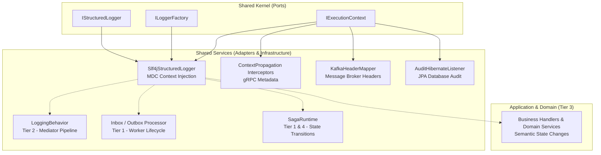

# Observability Architecture

This document describes the observability strategy (Logging, Tracing, Metrics, and Alerting) across the **SharedMicro Platform**, tracing how abstractions propagate from the Kernel down to Infrastructure Services.

## Architecture Diagram (Kernel to Services)



The system follows a **Port & Adapter (Hexagonal Architecture)** model:
1. **Kernel (`shared-kernel-application`)**: Defines pure ports (`IStructuredLogger`, `IExecutionContext`). It is completely agnostic to external libraries like Logback or OpenTelemetry.
2. **Infrastructure (`shared-services`)**: Provides the adapters (`Slf4jStructuredLogger`, `ContextPropagationClientInterceptor`, etc.) to automatically inject correlation contexts (`traceId`, `correlationId`, `tenantId`) into all logs, metrics, and traces.

---

## 4-Tier Logging Taxonomy

The platform enforces strict logging boundaries to prevent noise and ensure high-signal debuggability:

| Tier | Boundary | Description |
|---|---|---|
| **Tier 1** | **Platform Lifecycle** | Emitted by infrastructure modules (e.g., `Inbox message received`, `Redis lock acquired`). Levels: `INFO`, `WARN`. |
| **Tier 2** | **Application Pipeline** | Emitted by the `LoggingBehavior` inside the Mediator pipeline (`Handling <RequestType>`). Removes the need to log entry/exit inside business handlers. |
| **Tier 3** | **Business Domain** | Emitted inside Application/Domain services **only** for semantic business events (`User account locked`, `Payment rejected`). |
| **Tier 4** | **Error Boundary** | Emitted at the outermost error capture points (Global exception filters, Saga dead-letters, Kafka DLQ handlers). Level: `ERROR` (must include `Throwable`). |

---

## Context Propagation

Context is implicitly managed and propagated across system boundaries:

* **MDC & ThreadLocal**: `ExecutionContextHolder` stores the current context. `Slf4jStructuredLogger` automatically maps `traceId` and `correlationId` into the MDC for JSON log parsing.
* **gRPC Boundaries**: `ContextPropagationClientInterceptor` extracts the context and sends it over gRPC headers; the server interceptor reconstructs it.
* **Message Broker (Kafka/RabbitMQ)**: `KafkaHeaderMapper` serializes context variables into message headers prior to publish, ensuring background workers resume the same trace.
* **Database (JPA)**: `AuditHibernateListener` intercepts entity changes and extracts `principalId` from the context to log the exact user responsible for modifications.

---

## Metrics & Tracing

Services emit metrics and traces through **semantic interfaces**, not raw recorder calls:

* `IOutboxMetrics` / `IInboxMetrics`
* `ISagaMetrics`
* `IGrpcMetrics`

Raw metric names (e.g., `platform.inbox.processed`) are centralized in `MetricNames`. 
`IMetricsRecorder` is the generic adapter boundary inside `shared-services-infrastructure-observability` and must not be injected into application code.

### Tracing Convention
`ITracer` and `ITraceSpan` instrument long-running boundaries. Span names follow **PascalCase** (e.g., `SagaExecution`, `InboxProcess`), and attributes follow **camelCase**.

---

## Alert Delivery

Alert delivery is mandatory and must not terminate inside the observability stack.

```text
Service emits IOutboxMetrics / IInboxMetrics / ISagaMetrics / IGrpcMetrics
        │
        ▼
Prometheus evaluates alert rules (AlertDefinitions)
        │
        ▼
Alertmanager routes by: service · severity · environment
        │
        ▼
Slack channels (mandatory human response interface)
  #svc-<service>    → service-level alerts
  #incident-prod    → production incidents
  #deployments      → CI/CD notifications
  #infra-observability → platform alerts
```
