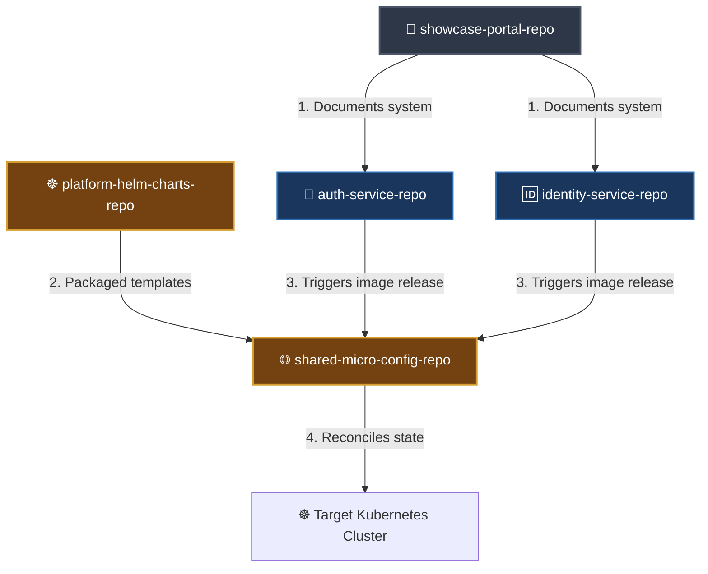

# 📦 Repository Directory Map

This document serves as the master directory of all public repositories comprising the microservices platform, outlining their roles, Git locations, and how they synchronize via GitOps continuous delivery.

---

## 🏗️ Repository Architecture & Flow

The ecosystem is completely decoupled, separating core business code, shared Helm charts, declarative environments configuration, and portfolio documentation:



---

## 📊 Repository Index

| Repository Name | Primary Role | GitHub Remote URL | Default Branch |
| :--- | :--- | :--- | :--- |
| **`microservices-platform-showcase`** | Portfolio root, system architecture overview, ADR files, system diagrams, and deep dives. | [`https://github.com/TriJames23/microservices-platform-showcase.git`](https://github.com/TriJames23/microservices-platform-showcase.git) | `main` |
| **`auth-service-repo`** | Microservice source code for the Authorization profiles, permissions mapping, and gRPC filters. | [`https://github.com/TriJames23/auth-service-repo.git`](https://github.com/TriJames23/auth-service-repo.git) | `main` |
| **`identity-service-repo`** | Microservice source code for the Identity profiles, session management, and JWT issuer. | [`https://github.com/TriJames23/identity-service-repo.git`](https://github.com/TriJames23/identity-service-repo.git) | `main` |
| **`platform-helm-charts-repo`** | Centralized generic Helm chart templates (`platform-service`, `postgres`, `kafka`, `redis`). | [`https://github.com/TriJames23/platform-helm-charts-repo.git`](https://github.com/TriJames23/platform-helm-charts-repo.git) | `main` |
| **`shared-micro-config-repo`** | Declarative GitOps environments values overrides and ArgoCD Application configurations. | [`https://github.com/TriJames23/shared-micro-config-repo.git`](https://github.com/TriJames23/shared-micro-config-repo.git) | `main` |

---

## 🛠️ Local Developer Onboarding & Setup

To clone, build, and run the microservices locally, follow these steps to ensure shared Maven contracts compile and reference correctly.

### 1. Configure the Shared Local Maven Repository
To enable microservices to instantly share gRPC and domain DTO contracts during local development, both `auth-service-repo` and `identity-service-repo` are configured to share a localized Maven repository.
*   **Target Directory:** `E:\MyProject\SharedMicro\.m2-codex-shared`
*   Ensure this directory exists on your local system before running the build step.

### 2. Cloning the Codebases
```bash
# Clone the showcase documentation:
git clone https://github.com/TriJames23/microservices-platform-showcase.git

# Clone the services:
git clone https://github.com/TriJames23/auth-service-repo.git
git clone https://github.com/TriJames23/identity-service-repo.git

# Clone the platform configuration and charts:
git clone https://github.com/TriJames23/platform-helm-charts-repo.git
git clone https://github.com/TriJames23/shared-micro-config-repo.git
```

### 3. Compilation & Local Module Install
Run the contract installations in order to publish shared gRPC stubs to the localized Maven repository:
```bash
# Install identity service contracts:
cd identity-service-repo
mvn clean install -pl :identity-service,identity-contract,identity-contract-grpc -DskipTests

# Install auth service contracts:
cd ../auth-service-repo
mvn clean install -pl :auth-service,auth-contract,auth-contract-grpc -DskipTests
```

---

## 🐙 GitOps Deployment Flow

1.  **Code Updates:** Developers commit features to `auth-service-repo` or `identity-service-repo`.
2.  **Continuous Delivery:** The Jenkins CI pipeline builds and tests the service, registers a new Docker image, and commits the tag update directly to `shared-micro-config-repo`.
3.  **State Sync:** The ArgoCD controller running inside the target Kubernetes cluster detects the new commit in `shared-micro-config-repo` and executes a rolling update deployment to match.
