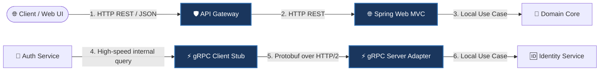

# 🛠️ Technology Stack Specification

This document provides a comprehensive technical breakdown of the frameworks, runtimes, protocols, and database engines powering the platform. Every technology has been carefully selected to ensure strict compliance with Clean Architecture, high operational throughput, and declarative GitOps delivery.

---

## 💻 Language & Runtime System

### ☕ Java 25 (OpenJDK LTS)
The platform is built on **Java 25**, leveraging modern JVM runtime enhancements, performance profiling, and language features:
*   **Virtual Threads (Project Loom):** Used to handle concurrent HTTP and internal requests without thread exhaustion, reducing memory footprint under high traffic.
*   **Pattern Matching & Records:** Extensively used inside domain layers to represent immutable Value Objects, Domain Events, and clear Command/Query payloads.
*   **Sequenced Collections:** Streamlines index-based list operations and aggregate reconstitution.

### 🍃 Spring Boot 3.4.x
Used as the application bootstrap container and adapter wireframe:
*   **AOT & GraalVM Native Readiness:** Structural beans are annotated with dynamic runtime indicators to allow compiling to high-performance native images.
*   **Spring Boot Actuator:** Formulates health states, liveness/readiness indicators, and metrics exposed at standard actuator endpoints.

---

## ⚡ Transport & API Protocols

To achieve optimal performance and strict decoupling, the platform separates client-facing APIs from internal microservice interactions:

### 1. HTTP REST / JSON
*   **Use Case:** Client-to-service communication and external API integration.
*   **Technology:** Spring Web MVC with Jackson JSON serialization.
*   **Highlights:** Strict RESTful routing, comprehensive error mapping via `@ControllerAdvice`, and standard API payload structures.

### 2. gRPC (Google Remote Procedure Call)
*   **Use Case:** High-speed, synchronous service-to-service queries.
*   **Technology:** Protobuf v3 + HTTP/2 multiplexing.
*   **Highlights:** Zero serialization overhead, compile-time typed stubs, contract-first design, and low latency under high load.

---

## 🗄️ Persistence, Caching & Locking

The platform enforces strict DB isolation per microservice. Database sharing is strictly forbidden.

### 1. PostgreSQL Cluster
*   **Use Case:** Primary relational database for transactional consistency (ACID).
*   **ORM Technology:** Spring Data JPA + Hibernate Core.
*   **Highlights:** Optimized transaction isolation levels, strict database migrations, custom entity lifecycle auditing, and isolated transactional boundaries.

### 2. Redis & Redisson
*   **Use Case:** Distributed lock manager and high-performance session cache.
*   **Technology:** Redis Sentinel + Redisson Java Client.
*   **Highlights:** Non-blocking distributed locks for critical business transactions (e.g. inventory allocations), token session revocations, and TTL-backed query caching.

---

## 📬 Distributed Event Streaming

### 🥩 Apache Kafka
The platform leverages Kafka as its asynchronous messaging backbone to coordinate distributed integrations and coordinate saga compensation steps:
*   **Inbox/Inbox Transactional Pattern:** Guarantees **At-Least-Once** event processing and prevents duplicate processing (idempotency).
*   **Partitioning Strategy:** Domain aggregates use unified partition keys to guarantee strict processing order of state updates.
*   **Resiliency:** Dead Letter Queues (DLQ) are configured for message consumer failure handling without blocking runtime partitions.

---

## 📉 Observability, Metrics & Telemetry

Observability is a core runtime requirement, not an afterthought:

*   **Prometheus:** Pulls application indicators, JVM metrics, and custom timers at `/actuator/prometheus` scraping endpoints.
*   **Grafana:** Dynamic visual control center showcasing P95 latency distributions, active JVM threads, database connection pool saturation, and HPA autoscaling thresholds.
*   **Micrometer:** Standardized instrumentation bridge inside the core codebase, keeping metric tracking separated from direct Prometheus APIs.

---

## 🛡️ Architecture Verification

### 🔍 ArchUnit
To prevent "spaghetti dependency structure" and maintain clean boundaries, we enforce ArchUnit tests inside CI gates:
*   Ensures domain modules have zero dependencies on external frameworks (e.g. Spring, JPA, Hibernate).
*   Verifies that HTTP controllers and gRPC adapters only interact with the application layer via command/query boundaries.
*   Guarantees that database entities never bleed into external API contracts.
